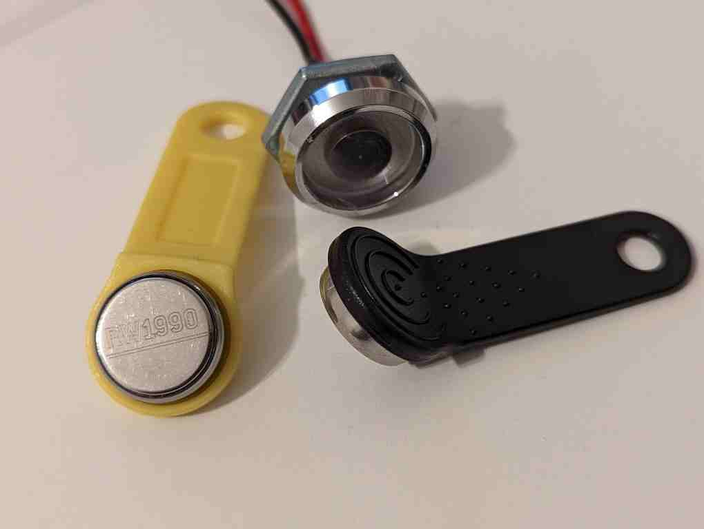

# iButton

A library to interact with iButtons, such as the DS1990A.

This library also supports the RW1990 which allows to modify the ID of the iButton.

## Connections
Typically, the readers have two wires, one for data/power and one for ground. The
1-wire protocol expects the data wire to be pulled up to power by a resistor.

Typically, iButton devices use very little power, and higher values of the pull-up
resistor are used to reduce the power consumption. However, for advanced
functionality, like writing data to the iButton, more power is needed. Sometimes,
choosing a lower resistance is good enough.

For simplicity, we recommend a 4.7k resistor when no special functionality is needed,
and a 2.2k resistor otherwise.

See https://pdfserv.maximintegrated.com/en/an/AN4255.pdf for more information on
how to power 1-wire devices.

## Trademarks
The iButton name and logo are trademarks of Maxim Integrated Products, Inc.

The 1-wire name and logo are trademarks of Maxim Integrated Products, Inc.
